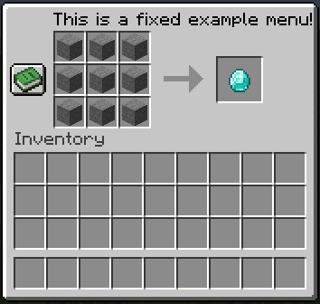
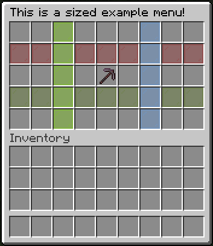
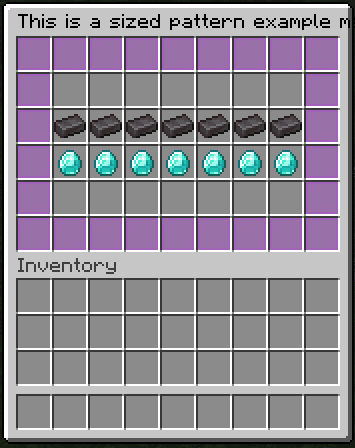
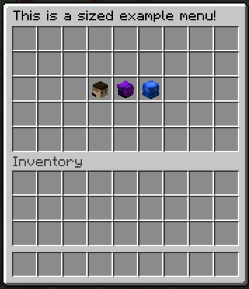

# Usage Examples

Layout is designed to make inventory creation intuitive, expressive, and highly flexible. Below are examples showcasing the main features of the library.

---

### Fixed Inventories (`LayoutFixedInventory`)

Fixed inventories have a predefined number of slots and a specific type, such as a crafting table or a dispenser. They are ideal for static menus with a consistent layout.

```java
final LayoutFixedInventory layoutFixedInventory = Layout.fixed()
        .type(FixedInventoryType.WORKBENCH)
        .title(Component.text("This is a fixed example menu!", NamedTextColor.BLACK))

        .fillAll(EmptyItemLayout.display(
                MaterialItem.builder()
                        .material(Material.STONE)
                        .build()
        ))
        .item(0, ClickableItemLayout.builder()
                .item(
                        MaterialItem.builder()
                                .material(Material.STONE)
                                .displayName(Component.text("This is a stone!"))
                                .lore(Component.text("Line 1", NamedTextColor.GREEN))
                                .build()
                )
                .onLeftClick(inventoryClickContext -> inventoryClickContext.player().sendMessage(Component.text("Left Click!")))
                .onRightClick(inventoryClickContext -> inventoryClickContext.player().sendMessage(Component.text("Right Click!")))
                .build()
        )

        .behavior(behaviorBuilder -> behaviorBuilder
                .closeOnClick(true)
                .onClick(context -> context.player().sendMessage("Click on inventory!"))
                .onClose(context -> context.player().sendMessage("Close inventory!"))
        )

        .build();

layoutFixedInventory.open(player);
```




### Sized Inventories (`LayoutSizedInventory`)
Sized inventories resemble a chest interface where you can define the number of rows. They allow you to create flexible menus of varying sizes.
```java
final LayoutSizedInventory layoutSizedInventory = Layout.sized()
        .title(Component.text("This is a sized example menu!", NamedTextColor.BLACK))
        .size(5)

        .item(22, ClickableItemLayout.builder()
                .item(
                        new MaterialItemBuilder()
                                .material(Material.NETHERITE_PICKAXE)
                                .displayName(Component.text("Netherite Pickaxe", NamedTextColor.GREEN))
                                .lore(
                                        Component.text("Line 1", NamedTextColor.GREEN),
                                        Component.text("Line 2", NamedTextColor.LIGHT_PURPLE)
                                )
                                .build()
                )
                .onLeftClick(clickContext -> clickContext.player().sendMessage("left click!"))
                .onRightClick(clickContext -> clickContext.player().sendMessage("right click!"))
                .onMiddleClick(clickContext -> clickContext.player().sendMessage("middle click!"))
                .build()
        )


        .row(1, new ItemLayout(new MaterialItem(Material.RED_STAINED_GLASS_PANE)))
        .row(3, new ItemLayout(new MaterialItem(Material.GREEN_STAINED_GLASS_PANE)))
        .column(2, new ItemLayout(new MaterialItem(Material.LIME_STAINED_GLASS_PANE)))
        .column(6, new ItemLayout(new MaterialItem(Material.LIGHT_BLUE_STAINED_GLASS_PANE)))

        .behavior(layoutBehaviorBuilder -> layoutBehaviorBuilder
                .cancelAllClicks(false)
                .cancelLayoutClicks(true)
                .allowPlayerInventoryClicks(true)
                .ignoreEmptySlots(true)
                .onClick(context -> context.player().sendMessage("Click on inventory!"))
                .onOpen(openContext ->
                        openContext.player().playSound(
                                openContext.player(), Sound.BLOCK_CHEST_OPEN, 1f, 1f
                        )
                )
                .onClose(closeContext ->
                        closeContext.player().playSound(
                                closeContext.player(), Sound.BLOCK_CHEST_CLOSE, 1f, 1f
                        )
                )
        )

        .build();

layoutSizedInventory.open(player);
```



### Pattern-Based Inventories (`LayoutSizedInventory` only)
Pattern-based inventories allow creating visually structured menus using a character grid. This feature is exclusive to `LayoutSizedInventory`.

```java
final LayoutSizedInventory layoutSizedInventory = Layout.sized()
        .title(Component.text("This is a sized pattern example menu!", NamedTextColor.BLACK))
        .patterned(patternBuilder -> patternBuilder
                .pattern(
                        "",
                        "",
                        " AAAAAAA ",
                        " BBBBBBB ",
                        "",
                        ""
                )
                .key('A', EmptyItemLayout.display(new MaterialItem(Material.NETHERITE_INGOT)))
                .key('B', EmptyItemLayout.display(new MaterialItem(Material.DIAMOND)))
        )

        .border(EmptyItemLayout.display(new MaterialItem(Material.MAGENTA_STAINED_GLASS_PANE)))
        .behavior(behaviorBuilder -> behaviorBuilder
                .onOpen(openContext -> openContext.player().sendMessage("Opened inventory"))
                .onClose(context -> context.player().sendMessage("Closed Inventory!"))
                .onClick(context -> context.player().sendMessage("Click on inventory!"))
        )

        .build();

layoutSizedInventory.open(player);
```



### Sized Inventories with Skulls (`LayoutSizedInventory`)
You can also use skulls to create player heads or custom textured heads in your layouts. This example demonstrates three different ways to display skulls: from a player, from a texture, or from a custom skin

````java
final LayoutSizedInventory layoutSizedInventory = Layout.sized()
        .title(Component.text("This is a sized example menu!", NamedTextColor.BLACK))
        .size(5)

        // Skull from player
        .item(21, new EmptyItemLayout(
                SkullItem.builder()
                        .player(player)
                        .build()
        ))

        // Skull from texture
        .item(22, ClickableItemLayout.builder()
                .item(
                        SkullItem.builder()
                                .texture("eyJ0ZXh0dXJlcyI6eyJTS0lOIjp7InVybCI6Imh0dHA6Ly90ZXh0dXJlcy5taW5lY3JhZnQubmV0L3RleHR1cmUvOWI2OGRmMDJkMGViY2ZhMmI0YTc3NDVhNDllYzAwZWZkNDJmN2E3MGVmNzNmYjdlZmI2MTA1NDRjZjBjMTA4ZiJ9fX0=")
                                .build()
                )
                .onLeftClick(inventoryClickContext -> 
                        inventoryClickContext.player().sendMessage(Component.text("Left click!"))
                )
                .build()
        )

        // Skull from custom skin value
        .item(23, EmptyItemLayout.builder()
                .item(
                        SkullItem.builder()
                                .skin("e609e36c6d6a631eb7b76b3eded9ccb37d2fea82031b50479be364bbd01e6340")
                                .build()
                )
                .build()
        )

        .behavior(layoutBehaviorBuilder -> layoutBehaviorBuilder
                .cancelAllClicks(false)
                .cancelLayoutClicks(true)
                .allowPlayerInventoryClicks(true)
                .ignoreEmptySlots(true)
                .onClick(context -> context.player().sendMessage("Click on inventory!"))
                .onOpen(openContext ->
                        openContext.player().playSound(
                                openContext.player(), Sound.BLOCK_CHEST_OPEN, 1f, 1f
                        )
                )
                .onClose(closeContext ->
                        closeContext.player().playSound(
                                closeContext.player(), Sound.BLOCK_CHEST_CLOSE, 1f, 1f
                        )
                )
        )

        .build();

layoutSizedInventory.open(player);
````


### 💡 Notes:
- Click events are handled through ClickContext. The library does not perform automatic actions; you decide what happens on each click.
- Sounds, commands, or other effects must be implemented manually using the ClickContext or OpenContext/CloseContext.
- Patterned inventories simplify visual layout creation but are limited to LayoutSizedInventory.
- This library is designed for flexible inventory creation in Minecraft plugins. It provides layouts and click handling, but all behavior is controlled by you.
